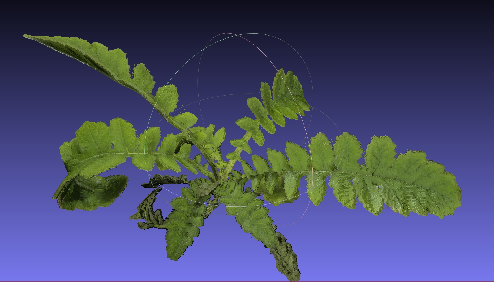

# Unreal Engine 5 Agricultural Robot Simulation

This repo host the Unreal Engine 5 part for the simulation, there is a seperate [ROS repo](https://github.com/NCSU-BAE-ARLab/AgriRoboSim_ROS) that work along side this simulation. 

[video demo](https://youtu.be/0kJrTDZCV2E)
[IROS 2023 Workshop Abstract](https://sites.google.com/illinois.edu/iros2023-agrobotics/accepted-papers)

`AgriRoboSim` contains the current project in development using UE5.3.

`Test2` contains UE5.1 version (outdated). `Test2 5.2` contains UE5.2 version (outdated).

*Important*: The Megascans assets (materials and plants) are not part of this repo, so you need to download those later from UE5 or the scenes will have missing high-quality plants and textures.

## Usage (UE5 portion)
This is tested on a windows 11 desktop, the UE5 simulation runs in Windows, the ROS part runs in WSL with rosbridge for communications (see separate repo for usage).

1. Clone repo in file manager and navigate to `Plugin` folder inside `Test2` or `Test2 5.2`
2. Clone [ROSIntegration repo](https://github.com/code-iai/ROSIntegration) in `Plugin` folder under the cloned repo
3. Launch UE5.3 in the Launcher
4. `Browse` and select the `AgriRoboSim.uproject` to open the project
5. Accept the prompt to rebuild now (wait for several minutes)
6. The project should open, the default level is `ur5e_tomato` that contains a husky robot with ur5e attached, tomato plants, and a room with missing textures.
7. The two robot arm level is `2-robot_plant_vis`, it should contain two ur10 arms and a room with missing textures. You can change to it through clicking in the content browser in the editor.
8. Before fixing textures, you might want to change settings for ROS communications by editing the `ROS_UR10e` blueprint under `ur10e` folder. For specifics see [ROSIntegration](https://github.com/code-iai/ROSIntegration), but I left it to use WebSockets over localhost.
9.  To fill the textures, go to Quixel Megascans to download some materials and plants by `Window -> Quixel Bridge` at the top of the editor. I used `Bog Marshcress` as the plant and some random materials for the room.
10. Place the plant on the stand and open `Room_BP` to add the material to the mesh components.
11. ~~To segment the plant, create a new `RenderTarget` with any color, duplicate the plant material and replace the `Albedo` with the new RenderTarget. Place and tag the plant with `SegmentImageGen` under `Actor` panel to render this inside the segmentation camera.~~
12. ~~Tag actors with `ColoredImageGen` for RGB and Depth (Scene Depth) rendering, `SegmentImageGen` for Segmentation rendering (base color, you need to post-process by remove the alpha channel from the pngs). These images will be saved under `Test2 5.2/Saved/Test` folder during simulation.~~
13. The simulation can be run alone, but to control the arm and capture images, I recommend using the [ROS part of the repo](https://github.com/XingjianL/AgriRoboSim_ROS).

# Images
Point cloud reconstructed from the simulation using RGBD images and segmentation masks using 24 setpoints.

